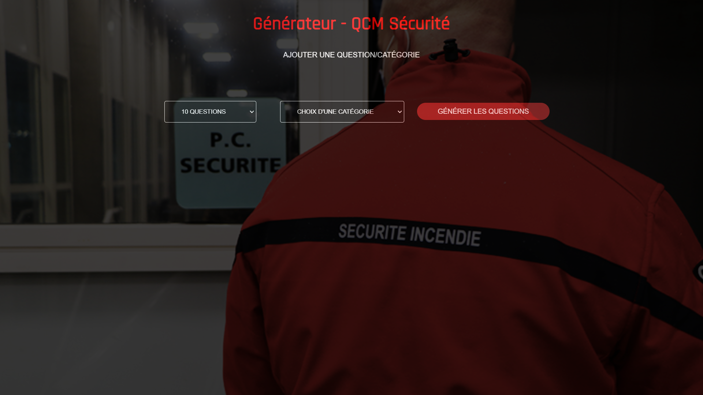
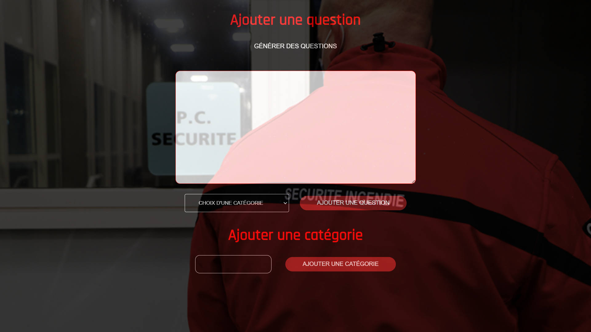

# Générateur QCM Sécurité Incendie

## Description

Site Web réalisé pour une demande d'un formateur/professeur d'agent de sécurité
Le site est en ligne pour l'accessibilité du formateur mais c'est un site "privé"

Le site génère un fichier écrit avec un nombre de questions et une catégorie choisi par l'utilsateur. Les questions doivent être générés aléatoirement. Quand on appuie sur le bouton générer un bouton apparaît pour télécharger le fichier .txt qui a été écrit. Également, le formateur demande de pouvoir copier/coller les questions et réponses dans le même endroit pour gagner en simplicité et en vitesse. Toutes ces questions/réponses sont stockées dans une base de données MySQL. Aussi l'utilisateur peut ajouter des catégories le plus facilement possible.

Le formateur m'a donné les éléments pour le style du site et m'a donné un maquette de son idée.

## Screenshots

### index.php

### ajout.php

## Ajouts possibles 

Actuellement, le site web génère un fichier .txt uniquement qui est déjà présent dans les fichiers du projet. Pour améliorer le site, je pourrais mettre plusieurs possibilité d'extensions (pdf,word) qui s'écrit tout comme le .txt. Également, le site n'est pas reponsive mobile, le formateur m'a informé que pour imprimer, il utilise que son ordinateur, donc ça le dérangait pas mais c'est un ajout possible. Aussi, la possibilité de transformer le site web en vrai logiciel est une modification possible

## Auteurs
Ce projet a été réalisé par moi-même

